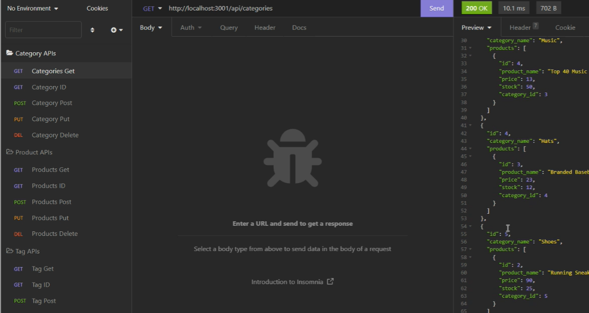

  <h1>Back-End-Bonanza: Ecommerce Edition</h1>

  
    
  

  
  ## Table of Contents
  -[Description](#description)  

  -[Installation](#installation)  

  -[Usage](#usage)  
  
  -[License](#license)  
  
  -[Contribution](#contribution)  

  -[Tests](#tests)  

  -[Questions](#questions)  

  ## Description

  
  An application that handles api calls following CRUD. Includes a database and seeds.
  Link to video demo available [here](https://drive.google.com/file/d/1OVkdRVF3JvZ8h13IPQ-IAhaFM-eRIy1c/view)!
  
  ## Installation
  npm install
  
  ## Usage
  Set up database using 'source db/schema.sql' within mysql, then seed the database with 'npm run seeds' within the terminal inside the root folder. Use insomnia to test api endpoints.
  
  ## License
  
  This was created under the MIT license.
  
  
  ## Contribution
  No need to contribute.
  
  ## Tests
  N/A
  
  ## Questions
  
  Any questions, comments or concerns, reach out at light2adrifter@yahoo.com.

  Git hub available at: [light2adrifter](https://github.com/light2adrifter/back-end-bonanza).

  

